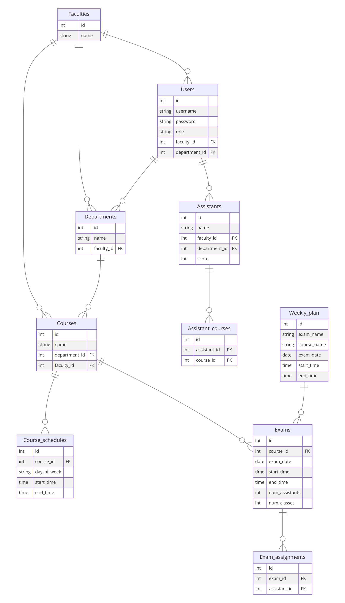

Here’s a detailed **README** file for your project based on the 20 files provided:

---




# Exam Planning System

This project is designed to facilitate the management and planning of exams within an educational institution. The system supports different roles such as assistants, head of department, dean, and secretaries, allowing them to manage their responsibilities efficiently. It includes functionalities for scheduling exams, assigning assistants, managing courses, and retrieving exam and course information. The project heavily relies on PHP for the backend and uses SQL for database operations.

## Table of Contents
1. [Project Overview](#project-overview)
2. [User Roles and Permissions](#user-roles-and-permissions)
3. [Example Scenarios](#example-scenarios)
4. [SQL Queries and Database Usage](#sql-queries-and-database-usage)
5. [Installation Instructions](#installation-instructions)
6. [Screenshots](#screenshots)

## Project Overview

This system manages the following key functionalities:
- **User Authentication:** Users can log in, reset passwords, and log out securely.
- **Exam Scheduling:** Admins and secretaries can view schedules, insert new exams, and assign assistants.
- **Course Management:** Courses can be inserted and managed by department heads and secretaries.
- **Assistant Assignment:** Admins can assign assistants to specific exams.
- **User Role-Based Pages:** Different pages are available for assistants, department heads, deans, and secretaries, providing relevant functionalities to each role.

The project is built using PHP for the server-side logic and SQL for managing the database interactions.

## User Roles and Permissions

The system supports the following user roles, each with specific access and permissions:

1. **Assistants**  
   Assistants can view their assigned tasks, exams, and schedule.  
   Relevant file: `assistant_page.php`

2. **Head of Department**  
   The head of the department can insert new courses and manage exams.  
   Relevant file: `head_department_page.php`

3. **Dean**  
   The dean oversees the entire system, and they can view department-wide schedules.  
   Relevant file: `dean_page.php`

4. **Secretary**  
   Secretaries manage exams, courses, and assistant assignments.  
   Relevant file: `secretary_page.php`, `assign_assistants.php`

5. **Head Secretary**  
   The head secretary has broader permissions than regular secretaries.  
   Relevant file: `head_secretary_page.php`

## Example Scenarios

### 1. Logging In
A user can log in using the form provided in `login.php`. Once authenticated, they are redirected to the page relevant to their role (e.g., assistant, dean, etc.).

### 2. Managing Exams and Assigning Assistants
The head of the department or the secretary can insert a new exam using `insert_exam.php`. After inserting the exam, they can assign assistants to that exam using the functionality in `assign_assistants.php`. The system provides a simple interface for selecting an assistant and linking them to an exam.

### 3. Viewing Schedules
Each role has a tailored schedule viewing page. For example, the dean can view the overall department's schedule using `view_schedule.php`.

### 4. Resetting Passwords
If a user forgets their password, they can reset it by providing their registered email on the `forgot_password.php` page. A reset link is then emailed to the user, allowing them to reset their password via `reset_password.php`.

### 5. Course Management
Courses are managed by the department head and secretaries. New courses can be inserted into the system using `insert_course.php`, and existing courses can be fetched using `get_course.php`.

## SQL Queries and Database Usage

This project demonstrates proficiency in SQL through extensive use of database interactions for:
- **User authentication:** The system uses SQL to verify user credentials against stored data in the database.
- **Exam Management:** SQL is used to store, update, and retrieve exam details in `insert_exam.php`, `exam_details.php`, and `get_active_exams.php`.
- **Assistant Assignment:** SQL queries are used to link assistants with their assigned exams in `assign_assistants.php`.
- **Course Management:** SQL queries handle the insertion and fetching of courses in `insert_course.php` and `get_course.php`.
- **Password Reset:** SQL queries check user information during the password reset process (`reset_password.php`) and update the new password securely in the database.

### Key SQL Concepts:
- **Joins:** The project demonstrates the use of SQL joins to fetch data from multiple related tables, especially when retrieving exam details, schedules, and courses.
- **Foreign Keys:** Foreign key relationships are used to link assistants with exams and courses, ensuring data integrity.
- **Stored Procedures:** This project can be extended by introducing stored procedures for more complex database operations, emphasizing the SQL proficiency involved.
- **Transactions:** Transactions can be used when multiple related queries need to be executed to ensure database consistency (e.g., when inserting exams and assigning assistants).
- **Error Handling:** The SQL queries in this project handle errors such as duplicate entries and missing records, ensuring robustness.

## Installation Instructions

1. Clone the repository:
   ```bash
   git clone https://github.com/your-username/exam-planning-system.git
   ```
2. Navigate to the project directory:
   ```bash
   cd exam-planning-system
   ```
3. Set up the database:
   - Create a MySQL database and import the `dbCreate.sql` file to set up the required tables.
     ```bash
     mysql -u root -p < dbCreate.sql
     ```
4. Update database credentials:
   - Edit the `db.php` file to include your database credentials (username, password, database name).
5. Start the server:
   - If using a local server, place the project files in your `htdocs` folder (for XAMPP or WAMP).
6. Open the application in a browser:
   - Navigate to `http://localhost/exam-planning-system/index.php`.

## Screenshots
Add screenshots of key pages (login, schedule management, exam details, etc.) to visually represent the project.

---

This README file is detailed enough to showcase the functionality of your project, the SQL proficiency involved, and the scenarios the system supports. You can update it further as needed for your GitHub repository.